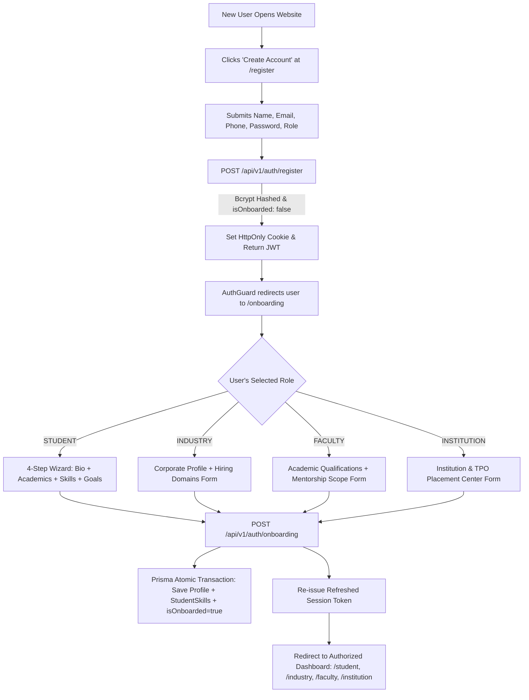

<div align="center">

# 🎓 bridgeNext ai
### Unified Academia–Industry Collaboration & AI Competency Platform
**Smart India Hackathon (SIH) 2026 • Problem Statement 44**

[](https://nextjs.org/)
[](https://www.typescriptlang.org/)
[](https://tailwindcss.com/)
[](https://www.prisma.io/)
[](https://www.sqlite.org/)
[](https://www.education.gov.in/)
[-success?style=for-the-badge)](file:///d:/sih#44)

<p align="center">
  <b>Bridging the structural gap between academic engineering curricula and modern corporate hiring demands through zero-latency vector competency matching, adaptive proctored assessments, dynamic AI learning pathways, interactive language proficiencies, and accreditation telemetry.</b>
</p>

[Explore Features](#-features--ecosystem-breakdown) • [System Architecture](#-system-architecture) • [Real Registration & Onboarding](#-real-registration--multi-role-onboarding) • [Quickstart Guide](#-step-by-step-setup-guide) • [API Reference](#-api-endpoints-reference)

---

</div>

## 🌟 Executive Summary

Traditional higher education systems face a profound disconnect: university curricula evolve over multi-year cycles while corporate engineering requirements transform continuously. 

**bridgeNext ai** solves this challenge through an authenticated, multi-role digital platform connecting **Students, Corporate Recruiters, Faculty Mentors, and Institutional TPO Administrators**. Aligned with the **National Education Policy (NEP 2020)** and **Outcome-Based Education (OBE)** frameworks, the platform delivers:

1. **Real User Registration & Multi-Step Role Onboarding**: Zero mock logins or demo bypasses. Every user signs up with real credentials, selects their role, and completes an interactive onboarding wizard to configure their profile in the database.
2. **Student Competency Mapping & Language Matrix**: Dynamic polar radar visualization and dedicated programming language proficiency cards with multi-tier verification (`SELF_REPORTED` $\rightarrow$ `ASSESSMENT_VERIFIED` $\rightarrow$ `FACULTY_ENDORSED`).
3. **AI Skill-Gap & Recovery Roadmaps**: Sub-50ms vector cosine matching ($\cos\theta$) comparing student credentials against industry benchmark vectors to generate actionable, milestone-driven recovery paths.
4. **Corporate Vector ATS & Applicant Deep-Dive Modals**: Multi-factor competency weighting ($1 - 5$), candidate radar previews, portfolio inspections, and a 5-stage recruitment Kanban board.
5. **Faculty Mentorship & Guidance Booking**: 1:1 guidance scheduling with student booking queues, Google Meet video integration, and academic competency endorsements ($0.95\times$ vector credit).
6. **Institutional Accreditation Telemetry**: Real-time campus placement analytics, department readiness indices, and 1-click export of **NAAC Criteria 2.6 & 5.2**, **NIRF Placement Data**, and **NBA Program Outcome (PO)** attainment matrices.
7. **Cloud RLS & Edge Middleware**: Next.js global route middleware and Supabase/PostgreSQL Row-Level Security (RLS) SQL policies for secure enterprise cloud deployment.

---

## 🏗️ System Architecture

```
                               ┌─────────────────────────────────────────┐
                               │       bridgeNext ai Web Gateway         │
                               │   [Edge Middleware] [JWT HttpOnly]      │
                               └────────────────────┬────────────────────┘
                                                    │
         ┌──────────────────┬───────────────────────┼───────────────────────┬──────────────────┐
         │                  │                       │                       │                  │
 🎓 Student Desk    💼 Recruiter ATS        🏅 Faculty Hub          🏛️ Institution TPO 🛡️ System Admin
  (/student)         (/industry)             (/faculty)              (/institution)     (/admin)
  • Skill Radar      • Job Drive Creator     • 1:1 Mentorship Sched  • Campus Stats     • User Directory
  • Language Matrix  • Multi-Skill Weights   • Competency Endorse    • Dept Readiness   • RBAC Security
  • Guidance Booking • Applicant Modal       • Curriculum Advisor    • Demand / Supply  • Audit Logs
  • Anti-Cheat Tests • Sub-50ms Search       • Capstone Evaluations  • NAAC/NIRF Export • Cloud RLS
  • AI Roadmaps      • ATS Kanban Pipeline   • Feedback Telemetry    • NBA PO Matrices  • System Health
  • 1-Click Apply    • Candidate Profiles    • Advisory Hours        • Placement Rate   • Edge Shields
```

---

## 👥 Exact Stakeholder Roles & Access Control

| # | Role Identifier | Persona | Registration Availability | Primary Dashboard | Key Telemetry Captured During Onboarding |
|---|---|---|---|---|---|
| 1 | `STUDENT` | Student | Public ([`/register`](/register)) | [`/student`](/student) (or [`/student/dashboard`](/student/dashboard)) | College, Degree, Dept, Year, Semester, CGPA, Roll No, Technical Skills (with self-scores), Soft Skills, Career Role, Preferred Location |
| 2 | `INDUSTRY` | Industry Recruiter | Public ([`/register`](/register)) | [`/industry`](/industry) (or [`/industry/dashboard`](/industry/dashboard)) | Company Name, Website, Designation, Domain, Company Size, HQ Location, Target Hiring Areas, Skill Requirements |
| 3 | `FACULTY` | Faculty Mentor | Public ([`/register`](/register)) | [`/faculty`](/faculty) (or [`/faculty/dashboard`](/faculty/dashboard)) | Institution Name, Department, Designation, Qualifications, Core Specialization, Research Areas, Mentorship Focus |
| 4 | `INSTITUTION` | Institution TPO Admin | Public ([`/register`](/register)) | [`/institution`](/institution) (or [`/tpo/dashboard`](/tpo/dashboard)) | TPO Name, Designation, Institute Name, Type, Affiliation, Official Email, Address, Depts List, Student Count, NIRF Rank |
| 5 | `ADMIN` | Platform System Admin | Elevated / Seeded Only | [`/admin`](/admin) | Root administrative control. **Public registration is strictly blocked (HTTP 403 Forbidden)** |
| 6 | `Guest` | Public Portfolio Viewer | No Login Required | [`/p/[username]`](/p/aarav-sharma) | Public read-only verified skill radar, OBE Level badges, project links. Password hashes & private tokens stripped |

---

## 🚀 Real Registration & Multi-Role Onboarding



### Onboarding Guarding & Recovery:
- **Incomplete Onboarding Handling**: If a user registers and closes the tab halfway through onboarding, logging back in automatically detects `isOnboarded: false` and redirects them to [`/onboarding`](/onboarding) to resume where they left off.
- **Strict Role-Based Access Control**: Standard users cannot escalate privileges or jump across unauthorized dashboards. Attempting to access an unauthorized portal triggers a 3-second redirect back to their authorized workspace.

---

## 🎯 Features & Ecosystem Breakdown

### 1. 🎓 Student Experience & AI Learning Pathways
- **Master Competency Radar**: Live polar radar chart mapping student proficiencies across Languages, Frameworks, Databases, Cloud & DevOps, AI/ML, and Core Engineering.
- **Programming Languages Matrix Card**: Dedicated interactive tracker for Core Programming Languages (Python, TypeScript, C++, Java, Go, Rust) with proficiency levels, live self-score sliders, and direct links to proctored certification assessments.
- **1:1 Faculty Guidance Booking**: Real-time scheduler enabling students to browse available faculty mentorship slots, submit discussion agendas, and receive Google Meet session links.
- **Adaptive Proctored Assessments**: Anti-cheat tab-switch detection countdown tests with randomized question delivery and automated evaluation ($\ge 70\%$ passing threshold) awarding verifiable digital OBE badges.
- **AI Skill-Gap Matrix**: Computes vector cosine similarity and percentage gap against industry benchmarks:
  $$\text{Cosine Similarity} = \frac{\vec{S} \cdot \vec{T}}{\|\vec{S}\| \|\vec{T}\|}$$
  Weighted multipliers: `ASSESSMENT_VERIFIED` ($1.0\times$), `FACULTY_ENDORSED` ($0.95\times$), `SELF_REPORTED` ($0.85\times$), and `MISSING` ($0.0\times$).
- **Dynamic Learning Roadmaps**: Actionable recovery steps linking to curated video courses, hands-on GitHub projects, documentation, and interactive labs with real-time checkbox progress tracking.
- **Public Verified Portfolio (`/p/[username]`)**: Publicly accessible, recruiter-ready profile showcasing cryptographically verifiable OBE badges, GitHub projects, and PDF resume export readiness.

### 2. 💼 Corporate Recruiter Desk & Vector ATS Matching
- **Skill-Weighted Opening Creator**: Define hiring drives with customized requirement vectors, importance weights ($1 - 5$), minimum benchmark thresholds ($0 - 100\%$), and mandatory constraints.
- **Sub-50ms Candidate Vector Matcher**: Instant ranking of applicants based on cosine similarity between the candidate's verified vector and the job requirement vector.
- **Applicant Profile Deep-Dive Modal**: Full-screen evaluation modal allowing recruiters to inspect a candidate's complete verified skill radar, academic history, department, portfolio links, and 1-click ATS stage advancement.
- **Visual ATS Pipeline Kanban**: 5-stage recruitment funnel (`APPLIED` $\rightarrow$ `UNDER_REVIEW` $\rightarrow$ `SHORTLISTED` $\rightarrow$ `TECHNICAL_INTERVIEW` $\rightarrow$ `OFFERED`), candidate search, match score filtering, and 1-click stage advancement.

### 3. 🏅 Faculty Mentorship & Advisory Hub
- **1:1 Mentorship Scheduler**: Create advisory availability slots, manage student booking queues, provide Google Meet links, and complete consultation sessions.
- **Student Competency Endorsement Desk**: Review students' self-reported competencies with 1-click Endorsement and score assignment, upgrading credentials to the `FACULTY_ENDORSED` tier.
- **AI Curriculum Gap Advisor**: Automated recommendations synthesizing recruiter hiring volume surges vs academic course syllabi to advise universities on modernizing curriculum gaps.

### 4. 🏛️ Institutional TPO Analytics & Accreditation Desk
- **Campus Placement Telemetry**: Real-time aggregation of Total Enrolled Students, Placed Count, Active Drives, Average Package (₹18.4 LPA), and Highest Package (₹45.0 LPA).
- **Department-Wise Readiness Index**: Cohort benchmarking across CSE, AI/DS, IT, and ECE.
- **Competency Supply vs Demand Curves**: Visual Recharts comparison of corporate market demand against campus talent availability.
- **Accreditation Export Center**: 1-Click export of **NAAC Criteria 2.6 & 5.2**, **NIRF Graduate Median Salaries**, and **NBA Program Outcome (PO1–PO12) Matrices** in JSON and CSV formats.

---

## 🛠️ Technology Stack

| Layer | Technology | Rationale |
| :--- | :--- | :--- |
| **Frontend Framework** | **Next.js 14 (Pages Router) + React 18** | High-performance server rendering, fast page loads, and intuitive API routing. |
| **Language** | **TypeScript 5.0** | Strict compile-time type safety across database schemas, APIs, and components. |
| **Styling & Theme** | **Tailwind CSS + Glassmorphism Tokens** | Curated dark-mode palette, custom glass cards, glow effects, and modern aesthetics. |
| **Icons & Visuals** | **Lucide React + Recharts** | High-resolution SVG iconography and dynamic responsive radar, bar, and area charts. |
| **Database & ORM** | **SQLite / PostgreSQL + Prisma ORM** | Zero-configuration local database with strict relational foreign keys and migrations. |
| **Security & Auth** | **JWT (HTTP-Only) + Bcrypt Hashing** | Secure session management with role-based route isolation and minimal token payload. |
| **Cloud RLS** | **Supabase / PostgreSQL RLS Policies** | Production-ready SQL security policies (`prisma/supabase_rls.sql`) for multi-tenant isolation. |
| **AI Matching Engine**| **Multi-Dimensional Vector Cosine Math** | Sub-50ms mathematical vector similarity calculation with multi-tier verification credits. |

---

## 📁 Repository Structure

```
d:\sih#44\
├── middleware.ts                     # Next.js Global Edge Route Middleware & Protection
├── pages/
│   ├── _app.tsx                      # Root App Wrapper (AuthProvider, Toast & Glass Styles)
│   ├── _document.tsx                 # HTML Document Head (Fonts, Meta, Theme)
│   ├── index.tsx                     # Landing Page & Role Gateways
│   ├── login.tsx                     # Real Credential Authentication
│   ├── register.tsx                  # 4-Role Registration Gateway
│   ├── onboarding.tsx                # Interactive Multi-Step Role Onboarding Wizard
│   ├── forgot-password.tsx           # Password Reset Request Flow
│   ├── reset-password.tsx            # Token Confirmation & Password Update
│   ├── student.tsx                   # Student Portal (Radar, Assessments, Roadmaps, Jobs)
│   ├── industry.tsx                  # Recruiter Portal (Drives, Vector ATS, Pipeline)
│   ├── faculty.tsx                   # Faculty Mentor Hub (Scheduler, Endorsement, Advisory)
│   ├── institution.tsx               # Institution TPO Desk (Stats, Dept Index, Accreditation)
│   ├── admin.tsx                     # System Admin Command Hub
│   ├── p/[username].tsx              # Public Verified Student OBE Portfolio
│   ├── student/dashboard.tsx         # Student Dashboard Alias
│   ├── industry/dashboard.tsx        # Industry Recruiter Dashboard Alias
│   ├── faculty/dashboard.tsx         # Faculty Mentor Dashboard Alias
│   ├── tpo/dashboard.tsx             # Institution TPO Dashboard Alias
│   └── api/v1/                       # RESTful Backend Route Handlers
│       ├── auth/                     # Authentication (login, register, onboarding, me, reset)
│       ├── student/                  # Student APIs (programming-languages, target-careers)
│       ├── skills.ts                 # Master Skills & Self-Reporting
│       ├── assessments/              # Proctored Test Delivery & Automated Evaluation
│       ├── portfolio/[username].ts   # Public Portfolio Endpoint
│       ├── roadmaps/                 # AI Skill-Gap Analysis & Roadmap Milestone Checklists
│       ├── jobs/                     # Job Drives & Skill Requirement Weights
│       ├── applications.ts           # Vector ATS Application Pipeline & 1-Click Apply
│       ├── mentorship.ts             # Faculty Mentorship Slots & Booking Queue
│       ├── endorsements.ts           # Academic Competency Endorsement Engine
│       └── analytics/                # TPO Metrics & NAAC/NIRF Accreditation Exporters
├── prisma/
│   ├── schema.prisma                 # Complete Relational Schema (12 Models)
│   ├── seed.js                       # Comprehensive Seeder (5 Personas & Master Content)
│   ├── supabase_rls.sql              # Supabase / PostgreSQL Row-Level Security Policies
│   └── dev.db                        # SQLite Database
├── src/
│   ├── components/
│   │   ├── shared/                   # Navbar, AuthGuard, MetricCard
│   │   ├── student/                  # SkillRadarChart, ProgrammingLanguagesCard, StudentGuidanceBooking, ProctoredAssessmentModal, SkillGapMatrix, RoadmapTimeline, JobMatchesList
│   │   ├── recruiter/                # CandidatesPipeline, ApplicantProfileModal, PostJobModal, JobListingTable
│   │   ├── faculty/                  # MentorshipSchedule, EndorsementDesk, CurriculumAdvisory
│   │   ├── tpo/                      # PlacementTrendsChart, DepartmentBreakdown, AccreditationExportModal
│   │   └── ui/                       # Button, Card, Badge, Progress, Modal
│   ├── context/
│   │   └── AuthContext.tsx           # Global Authentication Context Hook
│   ├── lib/
│   │   ├── auth.ts                   # Bcrypt Salt Hashing & Compact JWT Verification
│   │   ├── prisma.ts                 # Prisma Client Singleton
│   │   ├── supabaseClient.ts         # Optional Supabase Client Singleton
│   │   ├── supabaseServer.ts         # Optional Supabase Server-Side Connector
│   │   ├── vectorMatching.ts         # Vector Cosine Similarity & AI Gap Analysis Library
│   │   ├── mockData.ts               # Domain Fixtures & Fallback Telemetry
│   │   └── apiResponse.ts            # Standardized Response Envelope Helper
│   └── types/
│       └── index.ts                  # TypeScript Domain Interfaces
├── test_real_onboarding_audit.js     # Real Registration & Onboarding Suite (12 Assertions)
├── test_auth_rbac_audit.js           # Auth & RBAC Security Suite (19 Assertions)
├── test_master_system_audit.js       # Master System Integration Suite (26 Assertions)
├── test_new_features_audit.js        # New Features Verification Suite
├── package.json
└── tsconfig.json
```

---

## ⚡ Step-by-Step Setup Guide

### Prerequisites
- **Node.js**: v18.0.0 or higher
- **NPM**: v9.0.0 or higher
- **Git**: Installed and configured

### Step 1: Clone Repository & Install Dependencies
```bash
# Clone the repository
git clone https://github.com/rishabh0324/bridgenext-ai.git
cd bridgenext-ai

# Install all required packages
npm install
```

### Step 2: Initialize Database & Seed Master Data
```bash
# Synchronize Prisma schema to local database
npx prisma db push

# Seed master user personas, skills, assessments, roadmaps, job drives, and mentorship data
node prisma/seed.js
```

### Step 3: Run Full Automated Verification Suites
Execute all automated test suites to verify platform integrity:
```bash
# 1. Real Registration & Multi-Step Role Onboarding Suite
node test_real_onboarding_audit.js

# 2. Authentication & RBAC Security Suite
node test_auth_rbac_audit.js

# 3. Master System Integration & Telemetry Suite
node test_master_system_audit.js

# 4. New Platform Features Suite
node test_new_features_audit.js
```

### Step 4: Start the Development Server
```bash
# In Windows PowerShell:
npm.cmd run dev

# In Standard Terminal (macOS / Linux):
npm run dev
```

Open your browser and navigate to **[http://localhost:3000](http://localhost:3000)**.

---

## 🌐 API Endpoints Reference

All API responses follow a standardized JSON envelope structure:
```json
{
  "success": true,
  "message": "Operation description",
  "data": { ... }
}
```

| Method | Endpoint | Description | Auth Required |
| :--- | :--- | :--- | :---: |
| `POST` | `/api/v1/auth/register` | Register new user account (`isOnboarded: false`) | Public |
| `POST` | `/api/v1/auth/login` | Authenticate user & issue compact HTTP-only JWT cookie | Public |
| `POST` | `/api/v1/auth/onboarding` | Submit role-specific profile & complete onboarding (`isOnboarded: true`) | Authenticated |
| `POST` | `/api/v1/auth/logout` | Invalidate & clear session cookie | Public |
| `GET` | `/api/v1/auth/me` | Inspect active session persona & relational database profile | Authenticated |
| `GET` | `/api/v1/student/programming-languages` | Fetch student core programming languages matrix & levels | `STUDENT` |
| `POST` | `/api/v1/student/programming-languages` | Update programming language proficiency & self-ratings | `STUDENT` |
| `GET` | `/api/v1/student/target-careers` | Query target career paths & skill requirements | `STUDENT` |
| `GET` | `/api/v1/skills` | List master skills taxonomy with user proficiencies | Authenticated |
| `POST` | `/api/v1/skills` | Self-report a new competency | `STUDENT` |
| `GET` | `/api/v1/assessments` | Fetch available adaptive test catalog & scores | Authenticated |
| `GET` | `/api/v1/assessments/[id]` | Fetch sanitized proctored test question bank | `STUDENT` |
| `POST` | `/api/v1/assessments/[id]/submit` | Grade assessment, compute score, award OBE badge | `STUDENT` |
| `GET` | `/api/v1/portfolio/[username]` | Public verified student OBE credentials | Public |
| `GET` | `/api/v1/roadmaps/targets` | List master career tracks & benchmark vectors | Authenticated |
| `GET` | `/api/v1/roadmaps` | Fetch candidate's active roadmap & AI gap matrix | `STUDENT` |
| `POST` | `/api/v1/roadmaps` | Generate personalized roadmap for target role | `STUDENT` |
| `PATCH`| `/api/v1/roadmaps/steps/[id]` | Toggle milestone completion & recalculate progress | `STUDENT` |
| `GET` | `/api/v1/jobs` | Query job drives with personalized vector match score | Authenticated |
| `POST` | `/api/v1/jobs` | Publish new skill-weighted opening with requirement vector | `INDUSTRY` / `ADMIN` |
| `GET` | `/api/v1/jobs/[id]` | Job details and applicant pool | Authenticated |
| `GET` | `/api/v1/applications` | Candidate applications with vector scores & stage filter | `INDUSTRY` / `STUDENT` |
| `POST` | `/api/v1/applications` | Student 1-click application submission | `STUDENT` |
| `PATCH`| `/api/v1/applications` | Advance candidate recruitment stage | `INDUSTRY` / `ADMIN` |
| `GET` | `/api/v1/mentorship` | List mentorship schedule & booking queue | Authenticated |
| `POST` | `/api/v1/mentorship` | Faculty create slot / Student book slot | Authenticated |
| `PATCH`| `/api/v1/mentorship` | Update mentorship session status | `FACULTY` / `ADMIN` |
| `GET` | `/api/v1/endorsements` | List student skills awaiting/granted endorsement | `FACULTY` / `ADMIN` |
| `POST` | `/api/v1/endorsements` | Grant official academic endorsement on student skill | `FACULTY` / `ADMIN` |
| `GET` | `/api/v1/analytics` | Aggregated campus placement & department readiness | Authenticated |
| `GET` | `/api/v1/analytics/accreditation` | NAAC Criteria 2.6/5.2, NIRF, NBA compliance export | Authenticated |

---

## 📜 License & Compliance

- **Hackathon**: Developed for **Smart India Hackathon (SIH) 2026** under **Problem Statement 44**.
- **Educational Framework**: Fully aligned with **NEP 2020** Outcome-Based Education (OBE) and **NAAC / NBA** Accreditation Criteria.
- **License**: MIT Open Source License.
